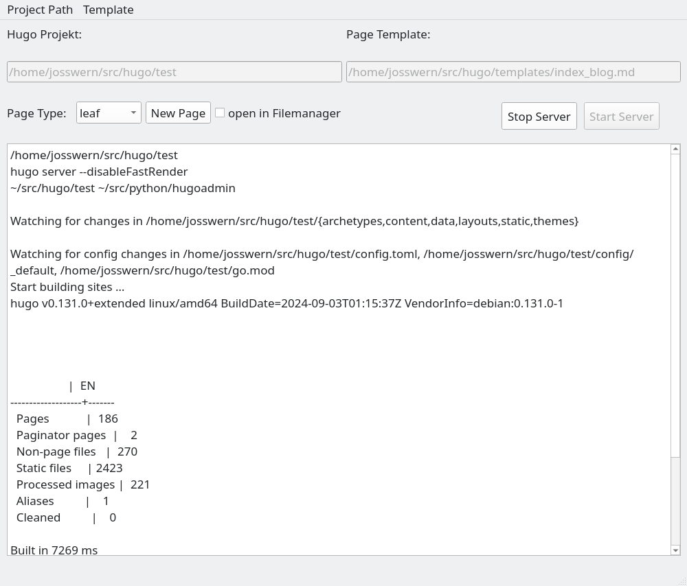

## hugoadmin.py - a simple Python GUI Tool that helps to manage the content in local Hugo Repositories

This Program ist a litte Helper that makes content administration (create/edit/check Pages..) of local Hugo Sites a bit easier.  
With this, you can eaysily
-	Choose the Hugo Project you like to work on
-	Create Pages and Blogposts inside the content Folder, based on Templates
-	add custom Templates or use existing Pages as Templates
-	directly edit the newly created Page(s)
-	start a local Hugo Server to view your Changes
-	start the Hugo Build Process

Configuration is done via yaml File ~/.config/hugoadmin.yaml

## Note:
This Program is built and has been tested on Debian Linux 13 (trixie), but should also work on any other Linux flavour - however,it will **NOT** work on Windows !

## Usage:
Before the first launch of the Application (hugoadmin.py) be sure to have the necessary nonstandard-Python Modules installed.  
In Debian 13, these are in the following Packages:
-	python3-pyqt6
-	python3-showinfilemanager
-	python3-yaml

alternativly, the corresponding Modules can be installed from Pypi via pip.

The next step is the adaption of the Configuration File ~/.config/hugoadmin.yaml to the personal needs, the provided file from this Repo can be used as a blueprint.  
Also note that hugoadmin_ui.py must be located in the same Directory as hugoadmin.py.  
The same holds for the 2 provided bash scripts, they are supposed to be executable (chmod +x).

Once all these prerequisites are done, hugoadmin.py should be ready to run.  
The most often used feature is probably the creation of a new Page, which is a two-step action:  
First, the base Directory where the new page will be located, has to be selected in a file dialog [like this](./pagedir.png).  
Then, the Name of the new page (without Path!) has to be defined in [this Popup](./pagename.png).  
As a result, the Page Directory will be created, then populated with an index File (index.md or _index.md, based on the selected Page Type), which is a Copy of the preselected Template File.  
This new index File will then be opened with the Editor defined in the Config File, and, if checked in the GUI, the new Directory will also be opened in the Filemanager (so additional Ressources like Images etc. can directly be added).

## TODO:
-	prettier GUI :-)
-	realize ability to add custom Templates via GUI
-	(maybe) add procedure to push built Site to Live Server